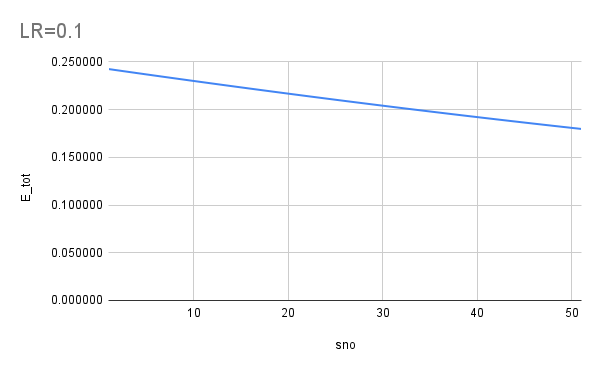
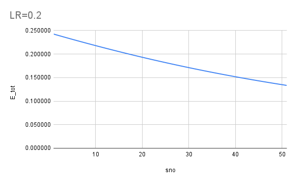
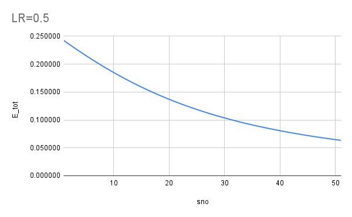
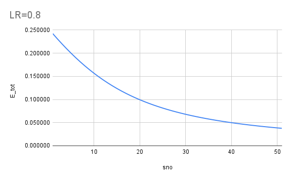
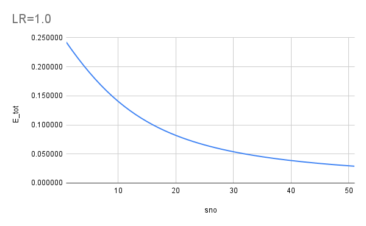
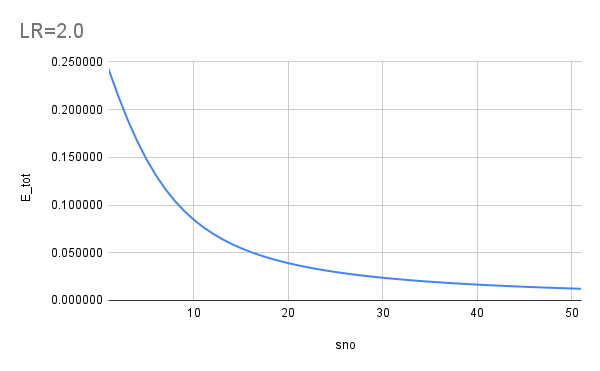

## Problem Statement
This is the assignment based on the Session 2.

1. Refer to the <link> for the excel sheet showing backprop on the following network

2. Below is the screenshot of the Excel that has been created.
 <SCREENSHOT TO BE ADDED>

3. Refer to the [Link](https://github.com/TSAI-END3-Group/Session_1_Assignment/blob/main/questions.ipynb) where we have explained the various formula derivations and how the learning happens

4. Below are the various error graphs that we got after using the various Learning rates as asked for [0.1, 0.2, 0.5, 0.8, 1.0, 2.0] 

## Error graphs 
For the various Learning Rates we see the error goes down differently. At the lowere LR the decrease in error is very slow and hence the learning is also slow. While for LR>=1 the error seem to go down very fast and that shows that the learning is fast at higher LR

Below are the error graphs obtained at different LRs

The error reduces at a very slow pace

The error reduction is faster than 0.1 but it still is mostly linear

In the initial epochs the error is reducing relatively fast and hence the curve

 
The error drop is more in the initial epochs and then stablizes 

The error drop is quiet fast and then it stablizes

The learning was very fast in the first 30 epochs and then it kind of stablizes. The error reduction is very slow after 30 epochs.

## Contributors
* Rohit Agarwal
* Vivek Kumar
* Kushal Gandhi
* Ammishaddai U