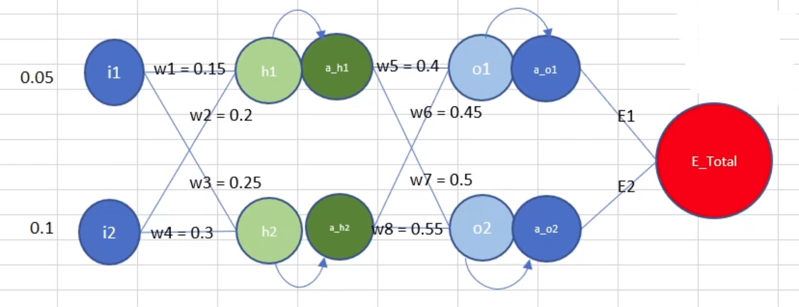
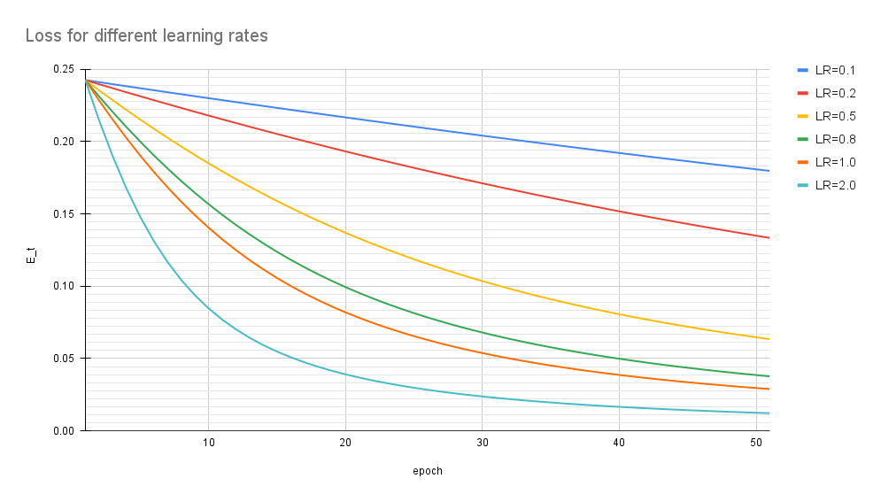

## Problem Statement
This is the assignment based on the Session 2.

1. Refer to the [Link](https://github.com/TSAI-END3-Group/Session_2_Assignment/Assignment_2_NN_Propogation.xlsx) for the excel sheet showing backprop on the following network

2. Below is the screenshot of the Excel that has been created.
 

3. Refer to the [Link](https://github.com/TSAI-END3-Group/Session_1_Assignment/blob/main/questions.ipynb) where we have explained the various formula derivations and how the learning happens

4. Below are the various error graphs that we got after using the various Learning rates as asked for [0.1, 0.2, 0.5, 0.8, 1.0, 2.0] 

## Error graphs 
For the various Learning Rates we see the error goes down differently. At the lowere LR the decrease in error is very slow and hence the learning is also slow. While for LR>=1 the error seem to go down very fast and that shows that the learning is fast at higher LR

Below are the error graphs obtained at different LRs

The above image is a comparison of effect of LR on the Loss.
Learning curve is on the the training dataset and gives an idea of how well the model is learning with each epoch

In the previous assignment we had discussed the effect of the LR on the network training (https://github.com/TSAI-END3-Group/Session_1_Assignment/blob/main/questions.ipynb) 

Some observations: 
1. The graph clearly shows that the learning was very slow when the LR was 0.1,0.2. The error was reducing very slowly with each epoch

2. The slope of the curve became steep once the LR >=1.0. Suggesting that the model is learning very fast. Infact the error became <0.05 within 20 epochs when the LR became 2 and after that the learnig was very slow

## Contributors
* Rohit Agarwal
* Vivek Kumar
* Kushal Gandhi
* Ammishaddai U